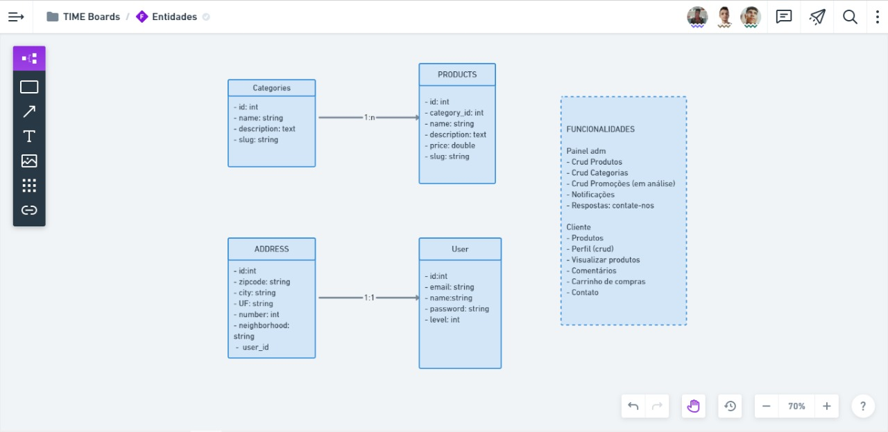
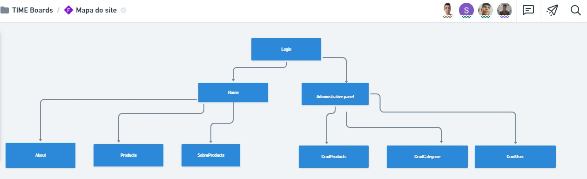

<!DOCTYPE html>
<html lang="pt-br">
<head>
<meta charset="UTF-8">
<meta name="viewport" content="width=device-width, initial-scale=1.0">
<meta http-equiv="X-UA-Compatible" content="ie=edge">
<meta name="Description" content="Enter your description here"/>
<link rel="stylesheet" href="https://cdnjs.cloudflare.com/ajax/libs/twitter-bootstrap/4.5.0/css/bootstrap.min.css">
<link rel="stylesheet" href="https://cdnjs.cloudflare.com/ajax/libs/font-awesome/5.14.0/css/all.min.css">
<link rel="stylesheet" href="assets/css/style.css">

</head>
<body>
<h1>Rlw-ecommerce-nodejs</h1>

## Regra de negócio e funcionalidades
 </img>
## Mapa do site
</img>

## Banco de dados
    MYSQL
## Frontend
    ReactJs
## Backend
    NodeJS 
    requisições-insominia 
# Configurações do NodeJS
-criar uma pasta para rodar o servidor
-dentro dessa pasta utiliza o comando pra instalar arquivo de dependência 
=> yarn init
-após cria a pasta src dentro dela cria um arquivo server.js(configuração de rotas)
-se tiver utilizando typescript instalar ele na 
-aplicação
=> yarn add typescript -D

=> yarn tsc --init ou npx tsc--init
-instalar dependencia do ts-node
=> yarn add ts-node-dev D 
   tipo um devtolls
=>yarn add express
  trabalhar com as rotas)

</body>
</html>